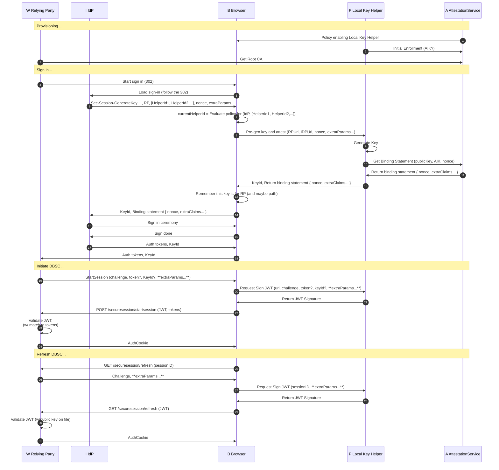
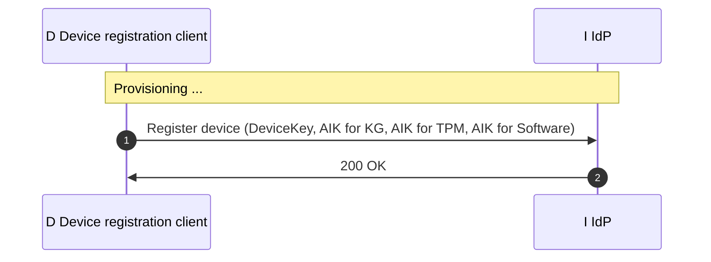
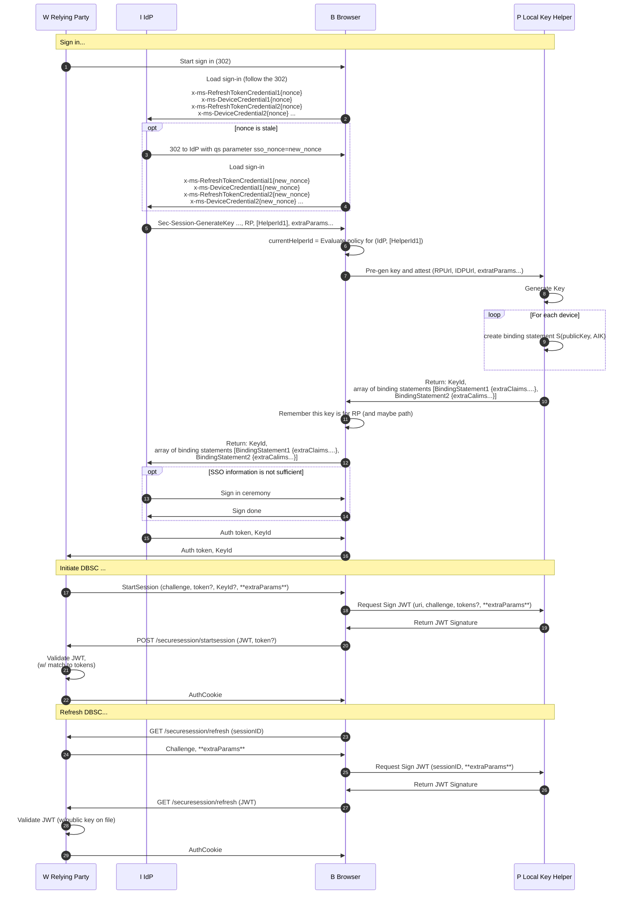
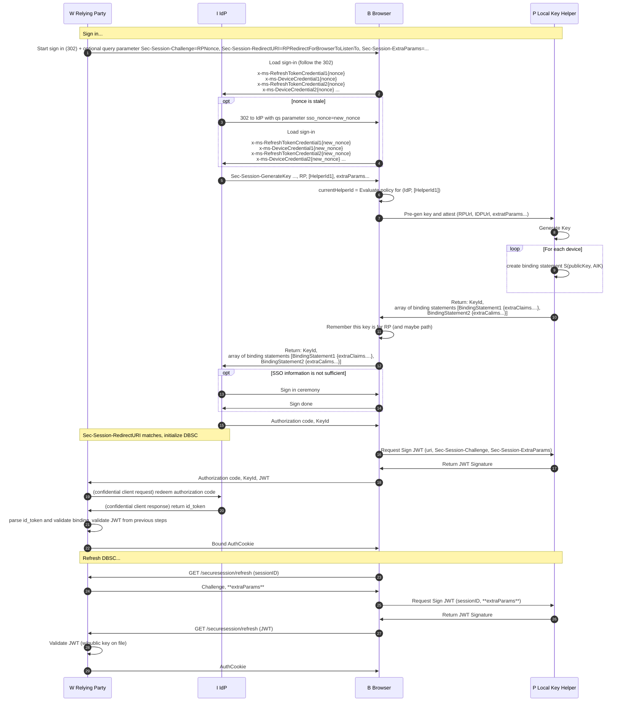
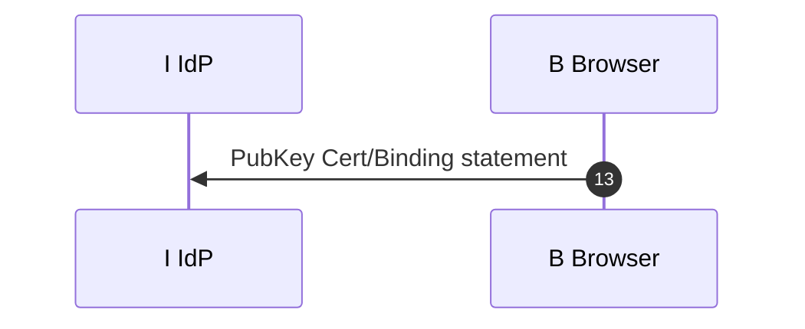

# IdP calls 3P Local Key Helper



# IdP calls 1P Local Key Helper

## Device registration



## DBSC key chaining



## DBSC key chaining (with perf optimization, confidential client)



# Open topics
1. Discuss refresh session doing inline with workload requests.

1. Pre-fetch nonce protocol open issue on git-hub, Kristian will discuss privacy concern with privacy team. Google ok to do it for enterprise, but not for consumers. Discuss with Erik for resouces for this optimization.

1.  Discuss nonce generation optimization. Can the browser call the OS for nonce-generation, provided the RPs build that optimization?


1. Start session optimization for DBSC (Olga will schedule internal disscussion on this, MS will try to come up with diagram.)

1.  Discuss optimizing the flow to avoid an extra redirect - step 17 (start session) can happen in 1 (redirect to IDP), step 20 (bind session) can happen in 16 (response from idp)


1.  Sec-Session-GenerateKey is an extra roundtrip in the 1st party diagram that is not required.

    [Olga] Step 12 is where browser remembers the key for RP+IDP combo. Maybe we consider current flow first time invocation scenario and for subsequent calls, browser sees RP/IDP combo, or understands some sort of a header, and performs this operation automatically?
    
1. Can any IDP call any local Local Key helper? Should IDP provider a list of key helper ids, not just one?
1. Will browser rember which KeyId belong to which LocalKey helper? (-yes, browser will rember which keyId) 
1. We need to capture, if key doesn't match to auth cookie, the app must retstart the flow.
1. How the local key helper is deployed? Concrete details?
1. Special/trusted by default Local Key helpers (Part of OS or Browser).
1. Protocol between IdP and LocalKey helper, if they belong to different vendors (Note: we need to solve clock-skew problem between IdP and Attestation server, probably embed nonce in the request)
1. Document that IDP must have a policy to enforce Binding key chaining to the same device.
1. Format of the public key cert/binding statement, and claims it contains.

    1. We can have multiple public key cert/binding statements for one key, when IdP and LocalKey helper are developed by the same vendor, how we include it?

    1. For the sign-in ceremony, after key generation happens, we should discuss how exactly we will deliver pubblic key cert/binding statements and whether it should be a header format. For example, step "Sec-Session-GenerateKey ..., RP , HelperId" is included in a header in a 302 response from IDP, does browser attach Pubkey/Attestation information as a header before executing on a 302?

1. Step 18 above, should it go to the LocalKey helper for signature? (-yes) If yes, how does step that initiates DBSC session know that it needs to go to the local key helper? (-KeyId will identify key helper) 

    [Olga] It needs to go to Local key helper for signature at least on non-Windows platforms.

1.  Do we need this step, if we planned to use KeyContainerId?

    [Olga] Maybe we can use this step to optimize second time invocation?

    ```mermaid
    sequenceDiagram
    %%{ init: { 'sequence': { 'noteAlign': 'left'} } }%%
    autonumber 12
    participant B as B Browser

    B->>B: Remember this key is for RP (and maybe path)
    ```

1.  Not sure if step 21 needs to be a POST, if we imagine StartSession from RP to be a 302 redirect, then it probably shouldn't be a POST

    ```mermaid
    sequenceDiagram
    %%{ init: { 'sequence': { 'noteAlign': 'left'} } }%%
    autonumber 21
    participant W as W Relying Party
    participant B as B Browser

    B->>W: POST /securesession/startsession (JWT, tokens)

    ```

1.  We should discuss provisioning flows too in more details


# Closed topics
1. If and app generates keys for itself, then in scope of this document IDP == RP.
1. Existance of the local key helper.
1. Local key helper can be a 3P software.
1. PublicKey cert/binding statement can be either short-lived (IdP and Local Key helper belong to different vendors) or long-lived(IdP and Local Key helper belong to the same vendor).
1. The protocol between LocalKey helper and Attestation service doesn't need to be documented as part of the public spec, it can stay internal.
1. Attestation service may not exist.
1. We need to clarify params for this call:
    ```mermaid
    sequenceDiagram
    %%{ init: { 'sequence': { 'noteAlign': 'left'} } }%%
    autonumber 8
    participant B as B Browser
    participant P as P Local Key Helper

    B->>P: Pre-gen key and attest (params?)
    ````````
    
1. We planned to use KeyContainerId here (Windows only): 

    Decision:  We send KeyId, and browser remebers set of key for RP. 


    ```mermaid
    sequenceDiagram
    %%{ init: { 'sequence': { 'noteAlign': 'left'} } }%%
    autonumber 13
    participant W as W Relying Party
    participant I as I IdP
    participant B as B Browser

    B->>I: PubKey Cert/Binding statement, _KeyContainerId_

    I->>B: Sign in ceremony
    B->>I: Sign done


    I->>B: Auth tokens, _KeyContainerId_
    B->>W: Auth tokens, _KeyContainerId_

    Note over W, B: Initiate DBSC ...
    W->>B: StartSession (challenge, tokens, _KeyContainerId_)
    ````````
1. Local key helper needs API for key deletion, for cookie cleanup? - yes, we need api for deletion of the keys. 
    * we can think about TTL for keys.
1. Should we introduce a new entity "Device registration client"? Local key helper should be considered as a part of the device registration client or not?


# Description (Draft)

## Overview

While the original DBSC provides cookie binding to a cryptographic key, it is vulnerable to malware that can run on a device during web application login. This malware can force the user to log in and provide its own controlled asymmetric key pair, thereby stealing the session. This proposal aims to mitigate this problem by introducing a device registration concept that binds the session to the device. If the device registration is performed when there is no malware on the device (a state referred to as a "clean room"), then malware will not be able to compromise the browser session even during web login moments. The only time malware can potentially compromise the device is during the device registration process, which occurs once in the device's lifetime (typically during OS or browser installation).

## Device regesration client

The device registration client is a software component that establishes the root of trust for a device. This document does not cover the protocol of the device registration, but it assumes that during the device registration, some asymmetric keys are shared between the client and backend, typically a device key and an attestation key.

As mentioned above, the key assumption is that device registration happened in a clean room environment, and it is the responsibility of the device owner to ensure this.

There can be multiple device registration clients on one device. The device registration client can be owned by:
* Operating system - the device gets registered when the OS is installed.
* Browser - the device gets registered when the browser is installed.
* Device management software (MDM provider) - the device gets registered when the MDM is enrolled.
* Third-party software vendor - the device gets registered according to the vendor rules.

## Local key helper

For the scope of this document, the local key helper is a software component of the device registration client. It serves as an interface responsible for DBSC key management.

The local key helper can be either public or private. A public local key helper can be accessed by any identity provider (IDP), while a private local key helper serves needs of a specific IDP.

The local key helper is responsible for:

* Generation of the binding key and producing binding statements (see below)
* Producing signatures with the binding key
* Cleanup of the binding key and its artifacts (when the user clears the browser session or the key is unused for a long time)

### Cleanup of the binding keys and their artifacts

For the health of the operating system and user privacy, it is important to clean up binding keys and their artifacts. If the number of keys grows too high, the performance of the OS can degrade.

The cleanup can occur:

* On demand, when the user decides to clear browser cookies
* Automatically, when a key hasn't been used for a long time (N days) to keep the OS healthy

## Attestation key and binding statement

# Meeting notes

## 5/22/2024

Discussed feedback regarding the general performance of DBSC. MS internally discussed and received feedback from other application developers that while DBSC is performant enough during active usage, it is not performant enough when the device/web app hasn't been used for a while.

Issue #1: The client has to wait for a network call to complete from the session refresh endpoint before workload navigation can happen. We can solve this problem by including a special header in the request with refresh session information. There are possible alternative approaches for this, which need to be discussed separately.

Issue #2: The nonce is not fresh on the client. We discussed multiple approaches:
1. Having a browser service to talk to some critical RPs to pre-fetch the nonce.
2. Allowing nonce pre-fetching by the local key helper.

Kristian will discuss privacy concern with privacy team. Google ok to do it for enterprise, but not for consumers. Discuss with Erik (MS) for resouces for design and implementation this optimization.

We've decided to open GitHub issues for the above problems.

There is also feedback on performance of StartSession, MS is working on alternative internally (Olga is driving it).


## 4/23/2024

We discussed properties of the PublicKey Cert/Binding statement from the step 13 of the flow diagram above.



It was demonstrated that in the scenario where a Contoso's IdP calls Fabrikam's Local Key Helper, this artifact should be short-lived, otherwise it is possible to take the PublicKey cert and the binding key from a device controled by the attacker and be able to bind the auth cookie to the malicious binding key.

It was also demonstrated that if both IdP and Local Key helper belong to the same vendor, then the public key cert/binding statement can be long-lived. As proof of possession of the device can be done during the authentication. After the device auth has happened the IdP can use the long-lived binding statement/public key cert to establish the fact that the binding key belongs to the same device.

We concluded that in some scenarios

- PublicKey cert/binding statement can be short-lived
- PublicKey cert/binding statement can be long-lived.

We also agreed that the format of the public key cert/binding statement should be public, but can be private, if IdP and Local key helper belongs to the same vendor.

We need to define the format of the public key cert/binding statement, and claims it contains.

For scenarios where PublicKey cert/binding statement is short-lived, we must solve a problem of clock-skew between 2 different servers IdP and Attestation servers. For that purpose IdP can pass nonce, which will be reflected inside PublicKey cert/binding statement. IdP will be able to validate nonce to ensure the public key cert/binding statement is freshly issued.

We agreed that the protocol between LocalKey helper and Attestation service doesn't need to be documented as part of public spec. The attestation service may not exists.

On the meating we discussed Local Key helper. We agreed that Local Key helper can be a 3P software (not developed by browser or OS). During the meeting we discussed that Local Key helper and Attestation service must be developped by the same vendor. It was also demonstrated that the attestation service may not exist, when IdP and LocalKey helper is one unit. After the meeting I came to conclusion, that given the attestation service may not exists, the source of truth is device, and I believe we should introduce a new entity "Device registration client" and Local key helper and device registration client should be one unit.

On the meeeting we agreed that Local Key Helper:

- can be owned by MDM client (3P MDM providers)
- can be owned by Device Registration client (MS on iOS, Android)
- can be owned by OS (MS on Windows, MAC)
- can be owned by Browser (Google Chrome)

Altentively we can think as Local Key helper is part of the device registation client. The device registartion client:

- can be owned by MDM client (3P MDM providers)
- can be owned by 3P vendor (MS on iOS, Android)
- can be owned by OS (MS on Windows, MAC)
- can be owned by Browser (Google Chrome)
