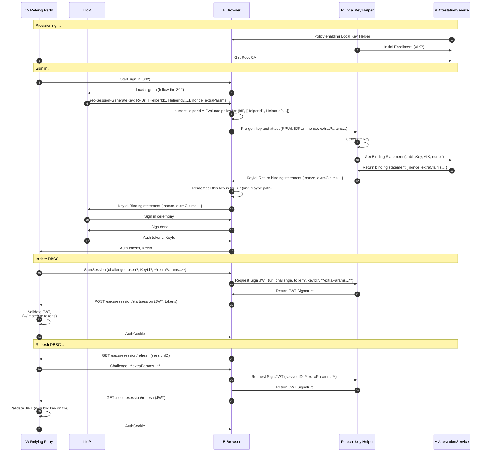

# IdP calls a public Local Key Helper



# IdP calls a private Local Key Helper

## Device registration


## DBSC key chaining (with perf optimization, confidential client)


# Open topics

1. We need to publish this spec on DBSC publicly, to get public feedback.
    
    Owners: Sameera & Kristian

1. Can we open this meeting for other industry leaders?

    Owners: Sameera & Kristian.

1. Coordinate a session to discuss the feasibility of implementing the protocol on Android, to be able to implement on android and later iOS.

    Owners: Kristian.

1. Discuss refresh session doing inline with workload requests.     
    
    Opened a git-hub issue: https://github.com/WICG/dbsc/issues/60

    Owners: Kristian. to resolve on this till 06/18.

1.  Discuss optimizing the flow to avoid an extra redirect - step 17 (start session) can happen in 1 (redirect to IDP), step 20 (bind session) can happen in 16 (response from idp) - Olga is owner.
   
    Owners: Sasha/Olga should try to document in the draft below.
   
1. How the local key helper is deployed? Concrete details?

    Owners: Sasha to write an original proposal for deployment.

1. Special/trusted by default Local Key helpers (Part of OS or Browser).

    Owners: Sasha to write an original proposal for special local key helpers.

1. Protocol between IdP and LocalKey helper, if they belong to different vendors (Note: we need to solve clock-skew problem between IdP and Attestation server, probably embed nonce in the request)

1. Format of the public key cert/binding statement, and claims it contains.

    1. We can have multiple public key cert/binding statements for one key, when IdP and LocalKey helper are developed by the same vendor, how we include it?

    1. For the sign-in ceremony, after key generation happens, we should discuss how exactly we will deliver pubblic key cert/binding statements and whether it should be a header format. For example, step "Sec-Session-GenerateKey ..., RP , HelperId" is included in a header in a 302 response from IDP, does browser attach Pubkey/Attestation information as a header before executing on a 302?


1.  Do we need this step, if we planned to use KeyContainerId?

    [Olga] Maybe we can use this step to optimize second time invocation?

    ```mermaid
    sequenceDiagram
    %%{ init: { 'sequence': { 'noteAlign': 'left'} } }%%
    autonumber 12
    participant B as B Browser

    B->>B: Remember this key is for RP (and maybe path)
    ```

1.  Not sure if step 21 needs to be a POST, if we imagine StartSession from RP to be a 302 redirect, then it probably shouldn't be a POST

    ```mermaid
    sequenceDiagram
    %%{ init: { 'sequence': { 'noteAlign': 'left'} } }%%
    autonumber 21
    participant W as W Relying Party
    participant B as B Browser

    B->>W: POST /securesession/startsession (JWT, tokens)

    ```

1.  We should discuss provisioning flows too in more details


# Closed topics

1. Pre-fetch nonce protocol open issue on git-hub, Kristian will discuss privacy concern with privacy team. Google ok to do it for enterprise, but not for consumers. Discuss with Erik for resouces for this optimization. Can the browser call the OS for nonce-generation, provided the RPs build that optimization?

    Opened a git-hub issue: https://github.com/WICG/dbsc/issues/61

    Decision: It is repsonsobility of the local key helper.

1. Can any IDP call any local Local Key helper? Should IDP provider a list of key helper ids, not just one?

1. Document that IDP must have a policy to enforce Binding key chaining to the same device.

1. We need to capture, if key doesn't match to auth cookie, the app must retstart the flow.

1. Step 18 above, should it go to the LocalKey helper for signature? (-yes) If yes, how does step that initiates DBSC session know that it needs to go to the local key helper? (-KeyId will identify key helper) 

    [Olga] It needs to go to Local key helper for signature at least on non-Windows platforms.

1.  [Not applicable] Sec-Session-GenerateKey is an extra roundtrip in the 1st party diagram that is not required.

    The new flow doesn't have this issue. Not applicable anymore.

1. [Documented] PublicKey cert/binding statement can be either short-lived (IdP and Local Key helper belong to different vendors) or long-lived(IdP and Local Key helper belong to the same vendor).

1. [Documented] Will browser rember which KeyId belong to which LocalKey helper? (-yes, browser will rember which keyId) 

1. [Documented] The protocol between LocalKey helper and Attestation service doesn't need to be documented as part of the public spec, it can stay internal.
1. [Documented] Attestation service may not exist.
1. [Documented] If and app generates keys for itself, then in scope of this document IDP == RP.
1. [Documented] Existance of the local key helper.
1. [Documented] Local key helper can be a 3P software.
1. [Documented] We need to clarify params for this call:
    ```mermaid
    sequenceDiagram
    %%{ init: { 'sequence': { 'noteAlign': 'left'} } }%%
    autonumber 8
    participant B as B Browser
    participant P as P Local Key Helper

    B->>P: Pre-gen key and attest (params?)
    ````````
    
1. [Documented] We planned to use KeyContainerId here (Windows only): 

    Decision:  We send KeyId, and browser remebers set of key for RP. 


    ```mermaid
    sequenceDiagram
    %%{ init: { 'sequence': { 'noteAlign': 'left'} } }%%
    autonumber 13
    participant W as W Relying Party
    participant I as I IdP
    participant B as B Browser

    B->>I: PubKey Cert/Binding statement, _KeyContainerId_

    I->>B: Sign in ceremony
    B->>I: Sign done


    I->>B: Auth tokens, _KeyContainerId_
    B->>W: Auth tokens, _KeyContainerId_

    Note over W, B: Initiate DBSC ...
    W->>B: StartSession (challenge, tokens, _KeyContainerId_)
    ````````
1. [Documented] Local key helper needs API for key deletion, for cookie cleanup? - yes, we need api for deletion of the keys. 
    * we can think about TTL for keys.
1. [Documented] Should we introduce a new entity "Device registration client"? Local key helper should be considered as a part of the device registration client or not?


# Description (Draft)

## Overview

While the original DBSC provides cookie binding to a cryptographic key, it is vulnerable to malware that can run on a device during web application logon. This malware can force the user to log in and provide its own controlled asymmetric key pair, thereby stealing the session. This proposal aims to mitigate this problem by introducing a device registration concept that binds the session to the device. If the device registration is performed when there is no malware on the device (a state referred to as a "clean room"), then malware will not be able to compromise the browser session even during web logon moments. The only time malware can potentially compromise the device is during the device registration process, which occurs once in the device's lifetime (typically during OS or browser installation).

In the context of this document, "Browser" refers to a functionality in a web browser that is responsible for the DBSC protocol. This functionality will be implemented by Edge, Chrome (or their common engine). It is expected that other web browsers will implement this as well.

Relying Party (RP) refers to a website that uses DBSC for cookie binding.

IdP (Identity Provider) is an authentication server that can be either external to the Relying Party or part of the Relying Party. The protocol doesn't change if the IdP is part of the Relying Party, except that some redirects between the IdP and the RP can be skipped or implemented by other means.

Other protocol parties: the device registration client, the local key helper and attestation service will be explained below.

## Device regesration client

The device registration is a process that establishes a trust between the device and a service that maintains a directory of all devices. This document does not cover the protocol of device registration, but it assumes that during device registration, some asymmetric keys are shared between the client and the service, typically a device key and some other keys necessary for the secure device communication.

A client software component that performs the device registration is called a _device registration client_.

As mentioned above, the key assumption is that device registration happened in a clean room environment, and it is the responsibility of the device owner to ensure this.

One device registration client can manager multiple devices on the same phisical device. There also can be multiple device registration clients on the same device. The device registration client can be owned and supported by:
* Operating system - the device gets registered when the OS is installed.
* Browser - the device gets registered when the browser is installed.
* Device management software (MDM provider) - the device gets registered when the MDM is enrolled.
* Third-party software vendor - the device gets registered according to the vendor rules.

## Local key helper

For the scope of this document, the local key helper is a software component of the device registration client. It serves as an interface responsible for DBSC key management.

The Local Key Helper can be either public or private. A public Local Key Helper can be accessed by any Identity Provider (IdP), while a private Local Key Helper serves the needs of a specific IdP. The private Local Key Helper is usually owned by the IdP and uses a private protocol, while the public Local Key Helper is owned by a provider different from the IdP, with a well-defined communication protocol.

The local key helper is responsible for:

* Generation of the binding key and producing binding statements (see below)
* Producing signatures with the binding key
* Cleanup of the binding key and its artifacts (when the user clears the browser session or the key is unused for a long time)

### Binding keys, binding statement and attestatation keys

A _binding key_ is an asymmetric key pair that is used to bind an auth cookie. This key is also defined in the DBSC original spec. The thumbprint of the key is stored in the session or auth cookies, depending on the implementation. It is expected that the binding key is created in a secure enclave on the original device. However, the original DBSC proposal doesn't allow to validate, as the binding key can be created on an attacker-controlled device.

The binding key is identified by a key ID. It is the responsibility of the browser to remember which key ID corresponds to which Local Key Helper and to use it for DBSC signatures and key management.

Additonally to the binding key, the local key helper produces a _binding statement_, a statement that asserts the binding key was generated on the same device as the device key. Details on how this statement is issued are out of scope for this document, but the key building block we plan to use for this is the _attestation key_ (see below).

The attestation key has the following properties:

1. It signs only other keys, private keys for which reside in the same secure enclave.
2. It cannot sign any external payload, or if it signs, it cannot produce an output that can be interpreted as an attestation statement.

The attestation key can be uploaded only once to the backend at the moment of device registration, in the clean room, and there is no need to change this key unless the device loses it due to some operations or key rotation operations. This key can be used to attest that the binding key belongs to the same device as the attestation key by signing the public part of the binding key with the attestation key and producing an attestation statement. Depending on the specific implementation, this attestation statement itself can be a binding statement, or it can be sent to an attestation service to produce the final binding statement. The validation component of the statement needs to authenticate the device, and using device ID and find the corresponding attestation key. The validation component knows that the attestation key will not produce such a statement unless it observes the private key in the same secure enclave at the moment of signature. Hence, a valid attestation statement means that both the attestation key and the binding key belong to the same device. The validation component can be part of the attestation service for public local key helpers, or part of an IdP for privat key helper.

Please note that this is not the only way to ensure that the binding key and the device key belong to the same device, and having the attestation key and the attestation service is not mandatory for producing a binding statement. That is why the protocol specifics of checking the binding are out of scope for this document. Here, we focus only on the important properties of the binding statement.

The Local Key Helper is an integral component of the Device Registration Client. A single Device Registration Client can support the identities of multiple devices. Furthermore, the device may be unknown at the moment of authentication. Consequently, multiple binding statements can be issued for a single binding key. This is an especially true for the private local key helpers.

Binding statements can be long-lived or short-lived. If an IdP can perform proof of device, it can use long-lived binding statements based on attestation keys to avoid extra network calls. IdPs that do not perform proof of possession of the device, the ones that use public local key helpers, must use short-lived binding statements to prevent forgery of the binding statement from a different device. To avoid binding statement forgery, a short-lived binding statement must have an embedded nonce sent by the IdP to validate that it is a fresh binding statement.

### Signing DBSC requests

The binding key can be created with special security restrictions or extra properties. The Local Key Helper is responsible for producing the signatures needed for DBSC functioning. 

### Cleanup of the binding keys and their artifacts

For the health of the operating system and user privacy, it is important to clean up binding keys and their artifacts. If the number of keys grows too high, the performance of the OS can degrade.

The cleanup can occur:

* On demand, when the user decides to clear browser cookies
* Automatically, when a key hasn't been used for a long time (N days) to keep the OS healthy

## End to end flow


# Meeting notes

## 6/11/2024

**Optimized diagram:** The team discussed the DBSC key chaining performance optimization with a focus on the start session. They agreed that the start session approach was acceptable and planned to document it. If any objections appear, we will discuss them accordingly.

The team agreed that caching IDP-specific helpers on any response from IDP should be acceptable.

[Sameera/Sasha] Need to review [the public Local Key Helper diagram](#idp-calls-a-public-local-key-helper) to check if the new changes are needed.

**Proposal for publishing on DBSC:** The team plans to draft a proposal for the key chaining to be published on the DBSC, aiming to gather feedback from third parties.

[Sameera/Kristian] Should start to work on publshing this spec publicly on DBSC.

**Concerns on Protocol Complexity:** The team expressed concerns about the complexity of creating a generic protocol, suggesting a need to review the overall architecture to ensure it remains manageable. 

**Session refresh for inactive device optimization:** The team debated various approaches for handling refresh sessions, including using workload request and the potential use of a JavaScript API. MS informed the group that GitHub issues were opened. The team discussed the importance of performance and the potential impact of making optional ability to deliver fresh JWTs for refreshing session.

We agreed that the nonce pre-fetch issue is the responsibility of the Local Key Helper.

[Sameera/Sasha] Need to document this.

[Kristian] will folllow up internally for using workload request and the potential use of a JavaScript API

**Android and Apple Platform Considerations:** The team discussed the feasibility of implementing key attestation on Windows, Mac, and Android platforms, noting the importance of standard adoption for broader platform support.
* Windows has all required API.
* Mac, iOS: we are waiting new shortly.
* Android: [Kristian] wil start engagement with Android team on producing API attestation API.

**Local Key Helper Deployment:**  The team agreed :
1. That the local key helper that comes with browser or OS are special, and will be respected by the browser accodingly.
2. We need to draft a proposal on deploying and registering local key helpers, aiming to reach a consensus on the approach for both first and third-party implementations. 

[Sasha] will draft the propoposal for Windows.

## 6/4/2024

We discussed a new optimization scheme for token binding, which Google is currently evaluating.

We also explored options and feedback for improving the refresh session performance. Two potential solutions were considered:
1. At the moment of cookie expiration, append the binding payload to all requests sent to the RP/Service.
2. Introduce a JavaScript API to address this issue.

## 5/22/2024

Discussed feedback regarding the general performance of DBSC. MS internally discussed and received feedback from other application developers that while DBSC is performant enough during active usage, it is not performant enough when the device/web app hasn't been used for a while.

Issue #1: The client has to wait for a network call to complete from the session refresh endpoint before workload navigation can happen. We can solve this problem by including a special header in the request with refresh session information. There are possible alternative approaches for this, which need to be discussed separately.

Issue #2: The nonce is not fresh on the client. We discussed multiple approaches:
1. Having a browser service to talk to some critical RPs to pre-fetch the nonce.
2. Allowing nonce pre-fetching by the local key helper.

Kristian will discuss privacy concern with privacy team. Google ok to do it for enterprise, but not for consumers. Discuss with Erik (MS) for resouces for design and implementation this optimization.

We've decided to open GitHub issues for the above problems.

There is also feedback on performance of StartSession, MS is working on alternative internally (Olga is driving it).


## 4/23/2024

We discussed properties of the PublicKey Cert/Binding statement from the step 13 of the flow diagram above.


It was demonstrated that in the scenario where a Contoso's IdP calls Fabrikam's Local Key Helper, this artifact should be short-lived, otherwise it is possible to take the PublicKey cert and the binding key from a device controled by the attacker and be able to bind the auth cookie to the malicious binding key.

It was also demonstrated that if both IdP and Local Key helper belong to the same vendor, then the public key cert/binding statement can be long-lived. As proof of possession of the device can be done during the authentication. After the device auth has happened the IdP can use the long-lived binding statement/public key cert to establish the fact that the binding key belongs to the same device.

We concluded that in some scenarios

- PublicKey cert/binding statement can be short-lived
- PublicKey cert/binding statement can be long-lived.

We also agreed that the format of the public key cert/binding statement should be public, but can be private, if IdP and Local key helper belongs to the same vendor.

We need to define the format of the public key cert/binding statement, and claims it contains.

For scenarios where PublicKey cert/binding statement is short-lived, we must solve a problem of clock-skew between 2 different servers IdP and Attestation servers. For that purpose IdP can pass nonce, which will be reflected inside PublicKey cert/binding statement. IdP will be able to validate nonce to ensure the public key cert/binding statement is freshly issued.

We agreed that the protocol between LocalKey helper and Attestation service doesn't need to be documented as part of public spec. The attestation service may not exists.

On the meating we discussed Local Key helper. We agreed that Local Key helper can be a 3P software (not developed by browser or OS). During the meeting we discussed that Local Key helper and Attestation service must be developped by the same vendor. It was also demonstrated that the attestation service may not exist, when IdP and LocalKey helper is one unit. After the meeting I came to conclusion, that given the attestation service may not exists, the source of truth is device, and I believe we should introduce a new entity "Device registration client" and Local key helper and device registration client should be one unit.

On the meeeting we agreed that Local Key Helper:

- can be owned by MDM client (3P MDM providers)
- can be owned by Device Registration client (MS on iOS, Android)
- can be owned by OS (MS on Windows, MAC)
- can be owned by Browser (Google Chrome)

Altentively we can think as Local Key helper is part of the device registation client. The device registartion client:

- can be owned by MDM client (3P MDM providers)
- can be owned by 3P vendor (MS on iOS, Android)
- can be owned by OS (MS on Windows, MAC)
- can be owned by Browser (Google Chrome)

[End]

# Cut (for history)

## DBSC key chaining


